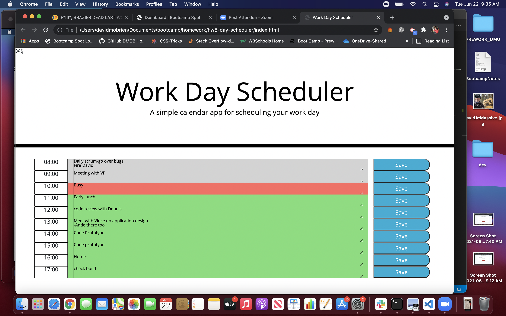

# hw5-day-scheduler

## Table of Contents
1. [General Info](#general-info)
2. [Screenshot](#screenshot)
3. [Technologies](#technologies)
4. [Installation](#installation)
5. [FAQs](#faqs)
### General Info
***
### David OBrien's Day Scheduler

Web based day scheduler application allows user to add calendar items dynamically
to page and have them stored with correct days. 

### Screenshot

## Technologies
***
A list of technologies used within the project:
  * HTML
  * Bootstrap
  * Javascript
  * jQuery
  * MomentJS

## Installation
***

Link to github repository- https://github.com/dmobrienllc/hw5-day-scheduler

Link to live site- https://dmobrienllc.github.io/hw5-day-scheduler/

## FAQs
***

Q Is this application awesome?

A Why yes it is!
---

